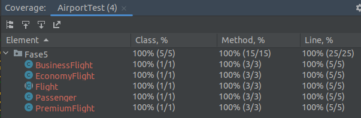

## Examen Parcial

# Pregunta 1
**¿Cuál es el resultado de la siguiente clase?**

-La salida del codigo anterior es: match.Y esto sucede porque p1.age=1<5 entonces result="match".

**¿Cuál es el resultado del siguiente código?**

-Este de arriba es el codigo Incorrecto tal y como esta en la pregunta.No compila y muestra: Cannot invoke append(int) on the primitive type int

-Este de arriba sería el codigo corregido y el resultado en pantalla seria: ok.   

**¿Qué lambda puede reemplazar la clase Secret1 para devolver el mismo valor?**

# Pregunta 2

**1 . Ejecuta el programa y presenta los resultados y explica qué sucede.**

Lo que hace el programa es crear 2 tipos de vuelos uno economico y uno de negocios.
Luego agrega a los pasajeros cesar y jessica como vip y no vip respectivamente.
Luego agrega a cesar al vuelo de negocios y es aceptado, después lo intenta eliminar y no lo hace ya que es un pasajero vip.
Luego se intenta agregar a jessica al vuelo de negocios pero como no es vip no se agrega y después se agrega a jessica al vuelo economico.
Finalmente muestra quienes están en cada vuelo. y vemos que jessica no se agrego al vuelo de negocios y que no se pudo remover a cesar del vuelo de negocios.

**2 . Si ejecutamos las pruebas con cobertura desde IntelliJ IDEA,¿cuales son los resultados que se muestran?,¿Por qué crees que la cobertura del código no es del 100%?. **

Vemos que en clases marca un 66% ya que no se usa para nada la clase Airport pero cubre la clase Flight y Passenger en un 100% a nivel de clase, ahora a nivel de métodos tenemos a Passenger en un 100% y Flight en un 83% con 5 metodos cubiertos y uno no el cual es getFlightType(). Por último a nivel de líneas Flight tiene 84% líneas cubiertas ya que no se cubre la linea del método getFlightType() ni tampoco las líneas donde se retorna RuntimeException en el caso default de los métodos addPassenger y removePassenger.

**3 . ¿Por qué John tiene la necesidad de refactorizar la aplicación?**

Porque es más eficiente y limpio dejar  a la clase vuelo como un clase con lo necesario y crear los métodos abstractos para que así cada clase de vuelo que herede de ella implemente sus métodos a su manera y con su funcionalidad(osea polimorfismo). Esto es más óptimo que usar condicionales como antes.

**4. Revisa la Fase 2 de la evaluación y realiza la ejecución del programa y analiza los resultados.**

Bueno vemos que ahora en esta fase ya no está la clase airport ya que esta ya no era de utilidad. También vemos que ahora los métodos abstractos addPassenger y removePassenger son abstractos para la clase flight y se crearon las clases EconomyFlight y BusinessFlight que heredan de flight y cada una implementa los métodos abstractos a su manera particular.
La prueba AirportTest tambien sigue probando lo mismo pero ahora el codigo de cobertura es del 100% en cada nivel. Esto se debe a que el campo flightType ya no es significativo y se eliminará entonces ya cubrirá todos los métodos y como ya no hay flightType se quita el riesgo de que se coloque uno que no estaba en la lista y retorna una excepción entonces ahora ya no hay eso también se cubren todas la líneas.

**5 . La refactorización y los cambios de la API se propagan a las pruebas. Reescribe el archivo Airport Test de la carpeta Fase 3.**

● ¿Cuál es la cobertura del código ? 

Es del 100% ya que engloba todos los métodos y líneas  de las clases: Flight, EconomyFlight, BusinessFlight y Passenger.

● ¿ La refactorización de la aplicación TDD ayudó tanto a mejorar la calidad del código?.

Si, ya que se ve más ordenado y cubre todas las pruebas de manera eficiente cumpliendo las condiciones del negocio.

**6 . ¿En qué consiste está regla relacionada a la refactorización?. Evita utilizar y copiar respuestas de internet. Explica como se relaciona al problema dado en la evaluación.**

Esta técnica consiste en que si vemos una misma porción de código repetido 2 veces lo permitamos pero que si encuentra una tercera se necesita refactorizar y abstraer en un método o función.

**7 . Escribe el diseño inicial de la clase llamada PremiumFlight y agrega a la Fase 4 en la carpeta producción.**

Como decía diseño inicial supuse que se refería a que los métodos addPassenger y removePassenger,  actúen como stubs: no hacen nada y simplemente devuelve false y lo adjunte en la fase 4 en la clase PremiumFlight.

**8 . Ayuda a John e implementa las pruebas de acuerdo con la lógica comercial de vuelos premium de las figuras anteriores. Adjunta tu código en la parte que se indica en el código de la Fase 4. Después de escribir las pruebas, John las ejecuta. **

Adjunté el código de pruebas y al ejecutarlas vemos que falla la prueba del vuelo premium cuando el pasajero es vip ya que debería retornar true tanto al intentar agregarlo como al eliminarlo pero nuestra actual clase PremiumFlight solo retorna false en los 2 casos siempre y tambien falla con el tamaño de la lista ya que se espera que sea 1 pero el método actual no agrega pasajeros a lista.

**9 . Agrega la lógica comercial solo para pasajeros VIP en la clase PremiumFlight. Guarda ese archivo en la carpeta Producción de la Fase 5.**

Hice lo que pide la pregunta además temporalmente ejecute el código copiando la respuesta de la pregunta 8 en la carpeta de Pruebas de la Fase 5.
Y bueno ahora ya sale todo correcto en las pruebas.

**10 . Ayuda a John a crear una nueva prueba para verificar que un pasajero solo se puede agregar una vez a un vuelo de manera que John ha implementado esta nueva característica en estilo TDD.**

Ya se ha implementado en el test de la fase 5 y todas las pruebas pasaron y hubo una cobertura del 100%

# Pregunta 3

**1 . ¿Cuales son los problemas de este código de prueba?.**

Primero BigDecimal está mal ya que en el constructor de Invoice es un tipo double.
Además junit5 en las Assertions no tiene assertThat.

**2 . Escribe una versión más legible de este código prueba. Recuerda llamarlo InvoiceTest.java**

Esto se encuentra en la siguiente imagen y también en el código de la pregunta 3.

**3 . Implementa InvoiceBuilder.java. Siéntete libre de personalizar sus constructores.**

Esto se encuentra en el código de la pregunta 3.Y solo agrupe ciertas propiedades y lo puse en el constructor ya que los otros metodos sirve para agregar propiedades a InvoiceBuilder.

**4 . Escribe en una línea una factura compleja. Muestra los resultados**

Esto se encuentra el código de la pregunta 3 y la línea sería:
Invoice in =new InvoiceBuilder().withAValueOf(2500).withCountry("US").asCompany().build(); 

**5 . Agrega este listado en el código anterior y muestra los resultados**

Esto se encuentra el código de la pregunta 3 y la línea modificada  sería:
Invoice in =new InvoiceBuilder().withAValueOf(2800).asCompany().fromTheUS();

**6 . Agrega este listado en el código anterior y muestra los resultados**

Copie el listado anterior modificando assertThat por assertEquals y adaptándolo y estos fueron los resultados:

