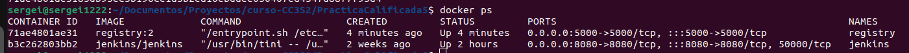

## Practica Calificada 5

# Pregunta 1
**Completa las actividades 23 y 24 sobre pruebas de aceptación y clustering con Kubernetes. Asegúrate de explicar tus resultados.**

**ACTIVIDAD 23**

docker run -d -p 5000:5000 --restart=always --name registry registry:2

El comando inicia el registro y lo hace accesible a través del puerto 5000. El contenedor registry se inicia
desde la imagen de registro (versión 2). La opción --restart=always hace que el contenedor se reinicie
automáticamente cada vez que esté inactivo.

docker ps

Con esto vemos los contenedores que estan corriendo:

docker logs registry

Con esto se consulta los registros de contenedor Docker para registry:

docker stop registry
docker rm registry

Con estos 2 comandos, primero se detiene el contenedor y luego lo elimina.

docker run -d -p 443:443 --restart=always --name registry -v `pwd`/certs:/certs -e REGISTRY_HTTP_ADDR=0.0.0.0:443 -e REGISTRY_HTTP_TLS_CERTIFICATE=/certs/domain.crt -e REGISTRY_HTTP_TLS_KEY=/certs/domain.key registry:2
 
Este comando hace lo mismo que se hizo antes pero con la diferencia de que los datos de registro se almacenan como un volumen de Docker en el directorio del sistema de archivos del host dado. Una vez que los certificados estén firmados por la CA o autofirmados, podemos mover el dominio.crt y domain.key en el directorio certs e inicia el registro, que escucha en el puerto seguro del HyperText Transfer Protocol Secure (HTTPS).

docker ps
docker stop registry
docker rm registry

Ahora denuevo ves como esta corriendo este registro para luego detenerlo y eliminarlo.

mkdir auth
docker run --entrypoint htpasswd httpd:2 -Bbn sergei1222 Slobodan123 > auth/htpasswd

Con esto se agrega una restricción de acceso creando un usuario con una contraseña utilizando la herramienta htpasswd de la imagen del registro, se crea un archivo auth/htpasswd

docker run -d -p 443:443 --restart=always --name registry -v `pwd`/auth:/auth -e "REGISTRY_AUTH=htpasswd" -e "REGISTRY_AUTH_HTPASSWD_REALM=Registry Realm" -e REGISTRY_AUTH_HTPASSWD_PATH=/auth/htpasswd -v `pwd`/certs:/certs -e REGISTRY_HTTP_ADDR=0.0.0.0:443 -e REGISTRY_HTTP_TLS_CERTIFICATE=/certs/domain.crt -e REGISTRY_HTTP_TLS_KEY=/certs/domain.key registry:2
 
Se establecen los certificados y se crea una restricción de acceso limitada a los usuarios especificados en el archivo auth/passwords. Como resultado, antes de usar el registro, el cliente debe especificar el nombre de usuario y la contraseña.

docker ps
docker stop registry
docker rm registry

Y de nuevo se detiene y se elimina el registro 

mkdir sample
cd sample

Con esto se crea la carpeta sample y se entra en ella 

nano Dockerfile

Con este se abre en modo edicion el archivo Dockerfile

FROM ubuntu:20.04
RUN apt-get update && \
    apt-get install -y python

y se agrega lo anterior y se guarda 

docker build -t ubuntu_con_python .

Con esto se construye una imagen llamada ubuntu_con_python con lo que habia en el dockerfile.

docker tag ubuntu_con_python sergei1222/ubuntu_con_python:1

Eso etiqueta la imagen para usar Docker Hub 

docker login --username sergei1222 --password Slobodan123

se inicia sesion para la autorizacion 

docker push sergei1222/ubuntu_con_python:1

podemos almacenar la imagen en el registro usando el comando push

y ahí vemos que se subio correctamente a docker hub.

docker rmi ubuntu_con_python sergei1222/ubuntu_con_python:1

Con esto eliminamos la imagen de manera local 

docker images

ahí podemos ver que ya no existe la imagen

docker pull sergei1222/ubuntu_con_python:1

Ahora la importamos a local desde docker hub 

docker images

ahora vemos como se importo de manera correcta la imagen desde docker hub 

cd ..

se retrocede para luego con 

cd calculador

entrar a calculador 

nano Dockerfile

se abre Dockerfile en modo edicion 

FROM openjdk:11-jre
COPY build/libs/calculador-0.0.1-SNAPSHOT.jar app.jar
ENTRYPOINT ["java", "-jar", "app.jar"]

se agrega lo anterior y se guarda 

./gradlew build
docker build -t calculador .
docker run -p 8081:8080 --name calculador calculador

Usando los comandos anteriores, creamos la aplicación, creamos la imagen de Docker y ejecutamos el
contenedor de Docker. Después de un tiempo, deberíamos poder abrir el navegador en
http://localhost:8081/sum?a=1&b=2 y ver 3 como resultado.

ahi vemos como nos da 3. 

git add .
git commit -m "Agregar Dockerfile"
git push

con lo anterior podemos detener el contenedor y enviar (push) el Dockerfile al repositorio de GitHub.

